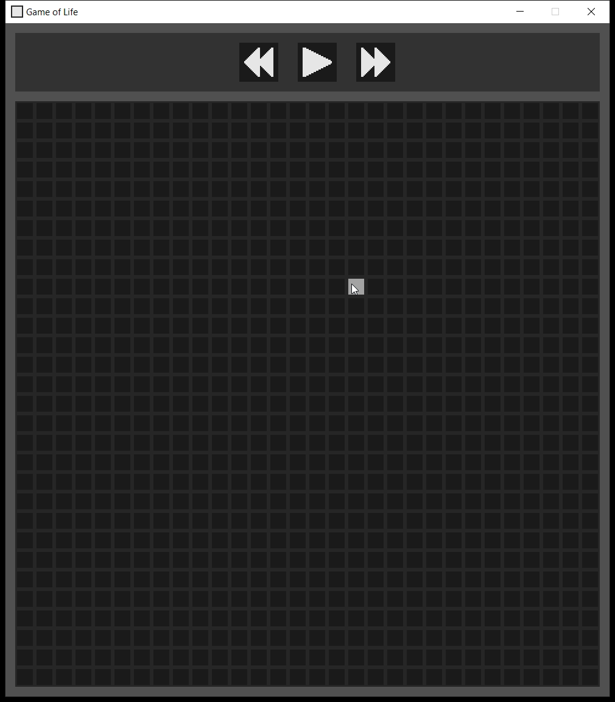

## Game of Life - raylib

### Description

[Conway's Game of Life](https://en.wikipedia.org/wiki/Conway%27s_Game_of_Life). Made with [raylib](https://www.raylib.com/) and based on the [Raylib Setup using Premake5](https://github.com/raylib-extras/game-premake) template.

### Features

Rules for the Game of Life:
 - Any live cell with two or three live neighbours survives.
 - Any dead cell with three live neighbours becomes a live cell.
 - All other live cells die in the next generation. Similarly, all other dead cells stay dead.

Quality of life features:
 - Play/pause button for the simulation.
 - The simulation can be sped up or slowed down with the corresponding buttons.

### Controls

 - While the simulation is paused, click and drag left click to set dead cells as alive
 - Or click and drag right click to set live cells as dead
 - Pressing the ESC key quits the game

### License

This game sources are licensed under an unmodified zlib/libpng license, which is an OSI-certified, BSD-like license that allows static linking with closed source software. Check [LICENSE](LICENSE) for further details.

*Copyright (c) 2023 Mattias Aksli (mattiasaksli)*
